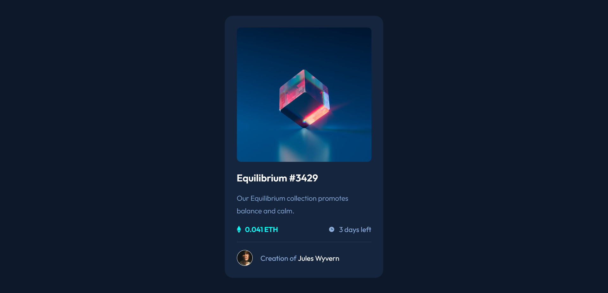

# Frontend Mentor - NFT preview card component solution

This is a solution to the [NFT preview card component challenge on Frontend Mentor](https://www.frontendmentor.io/challenges/nft-preview-card-component-SbdUL_w0U). Frontend Mentor challenges help you improve your coding skills by building realistic projects. 

## Table of contents

- [Overview](#overview)
  - [The challenge](#the-challenge)
  - [Screenshot](#screenshot)
  - [Links](#links)
- [My process](#my-process)
  - [Built with](#built-with)
  - [What I learned](#what-i-learned)
  - [Useful resources](#useful-resources)
- [Author](#author)

## Overview

### The challenge

Users should be able to:

- View the optimal layout depending on their device's screen size
- See hover states for interactive elements

### Screenshot

### Links

- Solution URL: [GitHub](https://github.com/jameswhatley/nft-preview-card-component)
- Live Site URL: [GitHub Pages](https://jameswhatley.github.io/nft-preview-card-component/)

## My process

### Built with

- HTML
- CSS 
- Flexbox

### What I learned

I learned how to do the image overlay. In addition, about setting the opacity of the alpha channel of the background for the overlay to change the opacity of the background but not the containing image.

### Useful resources

- [W3 Schools](https://www.w3schools.com/howto/howto_css_image_overlay.asp) - This helped me with the image overlay.
- [Stack Overflow](https://stackoverflow.com/questions/15449280/making-text-background-transparent-but-not-text-itself) - This helped me with setting the opacity of the overlay background without impacting the image inside.

## Author

- Frontend Mentor - [@jameswhatley](https://www.frontendmentor.io/profile/jameswhatley)
